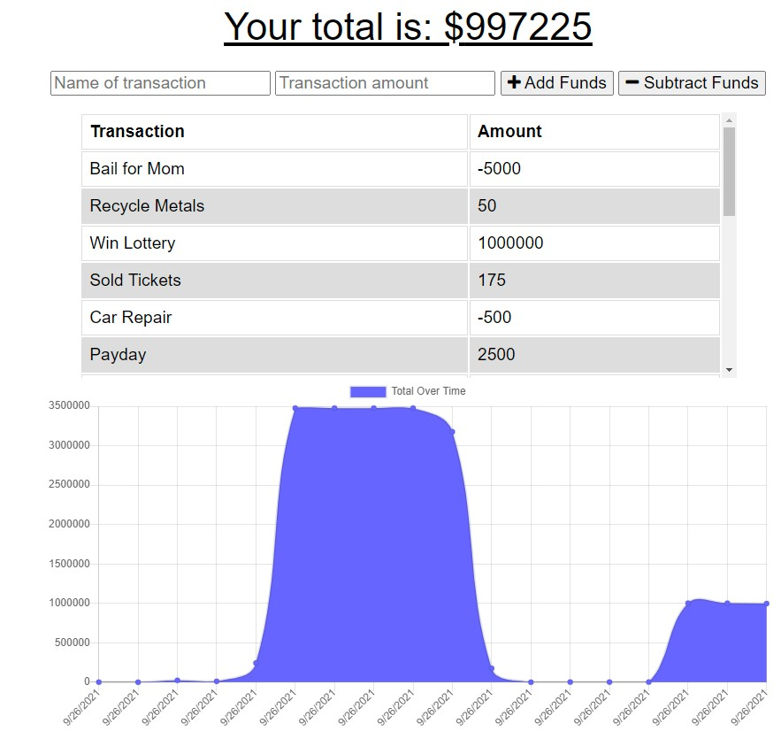

# Progressive Web Application - Online/Offline Budget App - Homework 19

## Description

Giving users a fast and easy way to track their money is important, but allowing them to access that information anytime is even more important. Having offline functionality is paramount to our applications success and in this progressive web app budget, you can do just that! Enter deposits or expenses and track your budget!

## Installation

- Visit my [Github Repository](https://github.com/patrickbrown-io/team-profile-generator-app)
- To install this app, clone the repository and npm i.
- See Useage for seeding with test data

## Usage

For a live deployment: [VIEW LIVE DEPLOYMENT](https://infinite-citadel-61093.herokuapp.com/)

## Walkthrough

Video walkthrough of working application: [YouTube](https://youtu.be/Yi4gxHCAjnY)

## Credits

[Patrick Brown](https://github.com/patrickbrown-io)

## Features

- Enter deposits and expenses!
- Online/offline functionality
- Progressive Web Application

## How to Contribute

Send me a message via GitHub and we can connect!
